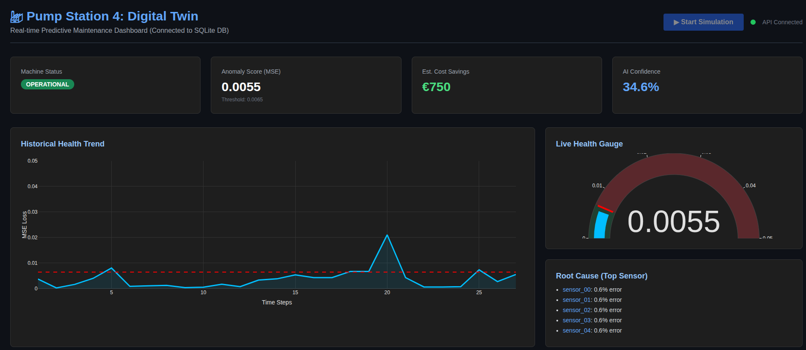
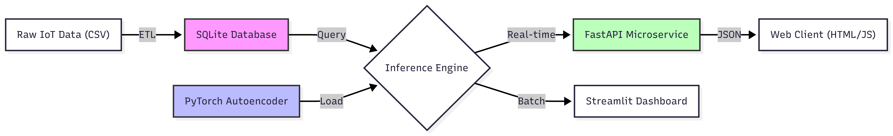

🏭 **Industrial Digital Twin: Predictive Maintenance Engine**

AWS Scheer Studentwerk Data Science Interview Project

"Bridging the gap between raw sensor data and actionable business insights."

---

## 📖 Project Overview

This project demonstrates an End-to-End Industrial AI Pipeline designed to predict machine failures before they occur. It simulates a real-world Digital Twin for a water pump station using IoT sensor data.

Unlike standard "notebook-only" projects, this solution is architected as a production-grade software package, featuring:

- **SQL Data Engineering**: Simulating an ERP/Historian extraction process.
- **Unsupervised Deep Learning**: Using a PyTorch Autoencoder to detect anomalies without needing labeled failure data ("Golden Batch" training).
- **Real-Time Inference**: A decoupled Inference Engine that simulates live IoT streaming.
- **Interactive Dashboards**: Both a Python-based (Streamlit) Control Tower and a modern Web-based (FastAPI + HTML) dashboard.

---

## 📸 Dashboard Preview



---

## 🏗️ System Architecture

The project follows a modular Object-Oriented (OOP) design pattern to ensure scalability and maintainability.



---

## 🚀 Key Features

### 1. Data Engineering (ETL) & SQL

- **Clean Architecture**: Raw CSV data is not used directly in training. It is first cleaned, processed, and loaded into a SQLite database to mimic a real industrial Historian.
- **Robust Handling**: Automated removal of "Ghost Sensors" (flatlines) and imputation of missing timestamps.

### 2. The AI Model (PyTorch Autoencoder)

- **Architecture**: A deep Undercomplete Autoencoder with Batch Normalization and Dropout.
- **Strategy**: Trained only on Normal data. The model learns the "physics" of a healthy machine. When a broken machine's data is fed in, the Reconstruction Error (MSE) spikes, flagging an anomaly.
- **Performance**:
  - **R² Score (Normal Reconstruction)**: 0.76 (Strong understanding of system dynamics).
  - **ROC-AUC Score**: 0.99 (Excellent separation of Normal vs. Failure).

### 3. Business Value Dashboard

- **Financial Impact**: Calculates estimated cost savings in real-time (€150/minute of downtime saved).
- **Root Cause Analysis**: Automatically identifies which sensors are contributing most to the anomaly, helping technicians fix the right part.

---

## 🛠️ Tech Stack

- **Language**: Python 3.x
- **Deep Learning**: PyTorch
- **Data Manipulation**: Pandas, NumPy, Scikit-Learn
- **Database**: SQLite3
- **Visualization**: Plotly, Streamlit
- **API/Web**: FastAPI, Uvicorn, HTML5, TailwindCSS

---

## ⚙️ Installation & Usage

### 1. Setup Environment

```bash
# Create virtual environment
python -m venv venv
source venv/bin/activate  # On Windows: venv\Scripts\activate

# Install dependencies
pip install pandas numpy torch scikit-learn matplotlib seaborn plotly streamlit fastapi uvicorn
```

### 2. Run ETL Pipeline (Database Creation)

This script reads `data/raw/sensor.csv`, cleans it, and populates `data/database.db`.

```bash
python src/etl.py
```

### 3. Train the AI Model

Trains the Autoencoder and saves the artifacts (`best_model.pth`, `scaler.joblib`) to the `models/` folder.

```bash
python notebooks/train_model.py
```

### 4. Option A: Run Streamlit Dashboard (Python Native)

```bash
streamlit run app.py
```

### 5. Option B: Run Web Dashboard (FastAPI + HTML)

#### Step 1: Start the Microservice

```bash
uvicorn src.api:app --reload
```

#### Step 2: Open `index.html` in your web browser.

---

## 🐳 Running with Docker

To simplify deployment, the project can be containerized using Docker. Follow these steps to build and run the Docker container:

### 1. Build the Docker Image

```bash
docker build -t predictive-maintenance .
```

### 2. Run the Docker Container

```bash
docker run -d -p 8000:8000 --name predictive-maintenance predictive-maintenance
```

### 3. Access the Application

- **FastAPI Dashboard**: Open your browser and navigate to `http://localhost:8000`.
- **Streamlit Dashboard**: If included, navigate to the appropriate port (e.g., `http://localhost:8501`).

### 4. Stop the Docker Container

```bash
docker stop predictive-maintenance
```

### 5. Remove the Docker Container

```bash
docker rm predictive-maintenance
```

## 📂 Project Structure

```plaintext
├── data/
│   ├── raw/                  # Place 'sensor.csv' here
│   └── database.db           # Generated by ETL
├── models/                   # Saved PyTorch models & Scalers
├── notebooks/
│   ├── advanced_eda.py       # Exploratory Analysis script
│   └── train_model.py        # Training logic
├── src/
│   ├── etl.py                # Data Engineering Class
│   ├── inference.py          # Real-time Inference Engine (OOP)
│   └── api.py                # FastAPI Backend
├── app.py                    # Streamlit Dashboard
├── index.html                # Modern Web Dashboard
└── README.md                 # Project Documentation
```

---

## 📊 Results Summary

The model successfully detects the transition from "Normal" to "Broken" hours before catastrophic failure.

| Metric      | Score | Interpretation                                      |
|-------------|-------|----------------------------------------------------|
| **ROC AUC** | 0.99  | Near perfect distinction between healthy and broken states. |
| **Precision** | Low   | Expected due to high class imbalance (safety-first approach). |
| **Recall**   | High  | The system catches the majority of failures (High Safety). |

---

**Author**: Mubeen Afzal
**For**: AWS Scheer (Studentwerk Interview)